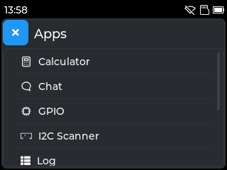
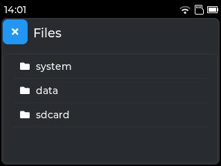

## Overview

Tactility is an operating system that is focusing on the ESP32 microcontroller.

&nbsp;&nbsp;

**Status: Alpha**

Next to desktop functionality, Tactility makes it easy to manage system settings:

 

There are also built-in apps:

  

Play with the built-in apps or build your own! Use one of the supported devices or set up the drivers for your own hardware platform.

