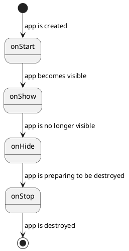

# Application Lifecycle

The app goes through these states:

Let's look at a scenario where an app launches another app:

1. `first` app starts: `first.onStart()` -> `first.onShow()`
2. `second` app starts: `first.onHide()` -> `second.onStart()` -> `second.onShow()`
3. `second` app stops: `second.onHide()` -> `second.onStop()` -> `first.onShow()`
4. `first` app stops: `first.onHide()` -> `first.onStop()`
